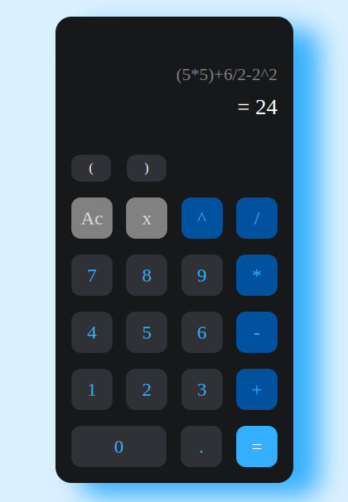

<h1 align="center">
    <b>Mathematical calculator</b>
</h1>

<p>
    A mathematical calculator built using stack data structure and Postfix expression <b>"Reverse Polish notation"</b>
</p>

<p align="center">
    
</p>

## **Steps to solve the problem:**
1. <a href="#checkBalanced">Is the expression balanced</a>
2. <a href="#convert">Convert the expression to postfix</a>
3. <a href="#eval">Evaluate the expression</a>

<h4 id="checkBalanced"><b><i>Check if the expression balanced:</i></b></h4>

``` javascript
let arePair = (c1, c2) => {
    if(c1 === '(' && c2 === ')')
        return true;
    else if(c1 === '[' && c2 === ']')
        return true;
    else if(c1 === '{' && c2 === '}')
        return true;
    else
        return false;
}

let isBalanced = (s) => {
    let stack = [];
    for(let i = 0; i < s.length; i++) {
        if(s[i] === '(' || s[i] === '[' || s[i] === '{') {
            stack.push(s[i]);
            continue;
        }

        if(s[i] === ')' || s[i] === ']' || s[i] === '}') {
            if(stack.length === 0 || !arePair(stack.pop(), s[i])) {
                return false;
            }
        }
    }
    return stack.length === 0;
}
```

<h4 id="convert"><b><i>Convert the expression to postfix:</i></b></h4>

``` javascript
let precedence = (sign) => {
    switch(sign) {
        case '(':
        case ')':
            return 1;
        case '+':
        case '-':
            return 2;
        case '*':
        case '/':
            return 3;
        case '^':
            return 4;
    }
    return -1;
}

let isOperator = (sign) => {
    return ['+', '-', '*', '/', '^'].includes(sign);
}

let postfixConvert = (expression) => {
    let stack = [], len = expression.length, res = "";

    for(let i = 0; i < len; i++) {

        let numberFlag = false;
        while(i < len && !isNaN(expression[i])) {
            res += expression[i++];
            numberFlag = true;
        }

        if(numberFlag) {
            res += ' ';
        }

        if(expression[i] === ')') {
            while(stack[stack.length-1] !== '(') {
                res += stack.pop() + ' ';
            }
            stack.pop();
        } else if(expression[i] === '(') {
            stack.push(expression[i]);
        } else {
            while(stack.length > 0 && precedence(expression[i]) <= precedence(stack[stack.length-1])) {
                res += stack.pop() + ' ';
            }
            stack.push(expression[i]);
        }
    }

    while(stack.length > 0) {
        res += stack.pop() + ' ';
    }
    res = res.split(' ');
    return res.filter(item => item !== '');
}
```

<h4 id="eval"><b><i>Evaluate the expression:</i></b></h4>

``` javascript
let calculate = (n1, n2, operation) => {
    n1 = parseFloat(n1), n2 = parseFloat(n2);
    switch(operation) {
        case '+':
            return n1+n2;
        case '-':
            return n1-n2;
        case '*':
            return n1*n2;
        case '/':
            return n2/n1;
        case '^':
            return Math.pow(n2, n1);
    }
    return 0;
}

let evaluation = (expression) => {

    // Remove any whitespaces.
    expression = expression.replace(/\s/g, '');
    if(expression.length > 0 && (expression[0] !== '(' || expression[expression.length-1] !== ')')) {
        if(isOperator(expression[expression.length-1])) {
            return null;
        }
        expression = '(' + expression + ')';
    }

    // Check if the given expression is valid.
    if(!isBalanced(expression)) {
        return null;
    }

    let expArray = postfixConvert(expression),
        stack = [];
    for(let i = 0; i < expArray.length; i++) {
        let current = expArray[i];

        // check if variable is operator or oprand
        if(isNaN(current)) {
            let num1 = stack.pop();
            let num2 = stack.pop();
            stack.push(calculate(num1, num2, current));
        } else {
            stack.push(current);
        }
    }
    return stack.length === 1? stack.pop(): null;
}
```